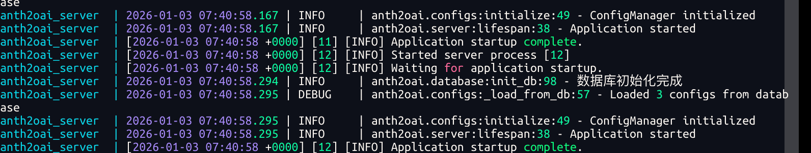
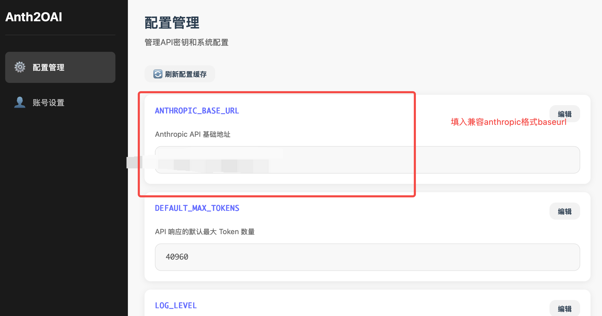
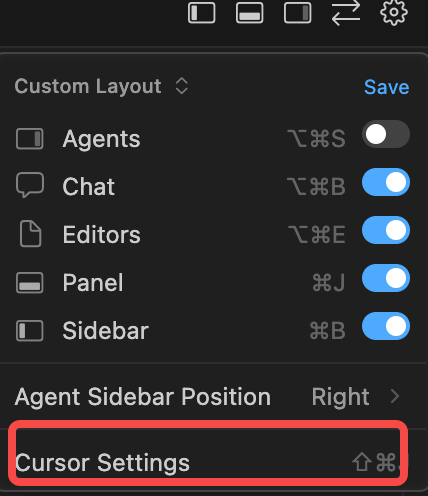
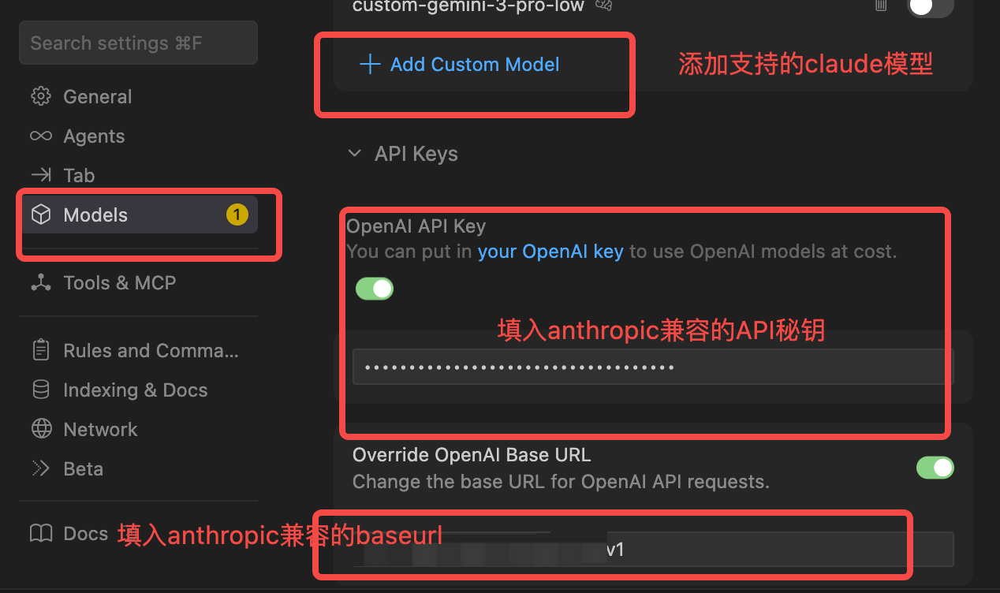

# anth2oai

将 Anthropic Claude API 转换为 OpenAI 兼容格式的代理服务。

[](https://github.com/linkedlist771/anthropic-openai-wrapper)
[](LICENSE)

## 概述

anth2oai 让你在任何支持 OpenAI API 的工具中使用 Claude 模型，包括 Cursor、Continue、Windsurf 等 AI 编程助手。

## 部署

使用 Docker Compose 一键部署：

```bash
# 克隆仓库
git clone https://github.com/linkedlist771/anthropic-openai-wrapper.git
cd anthropic-openai-wrapper

# 创建环境配置
cp .env.example .env

# 启动服务
docker compose up -d
```
> 可在 `.env` 中配置 `ANTHROPIC_BASE_URL`，支持 Anthropic 官方或兼容格式的 API 端点，也可在管理面板中修改。

服务启动后访问 `http://localhost:8363/admin` 进入管理面板。

默认账号：`admin` / `admin123`

## 配置

### 管理面板

在管理面板中配置：


- **API Base URL** - Anthropic API 端点（默认 `https://api.anthropic.com/v1`）

### AI IDE 配置

以 Cursor 为例，前置条件：你需要一个公网服务器（因为 Cursor 不支持局域网访问），还有一个兼容 Anthropic 格式的 API 密钥。这里假设其分别为 `wan_ip`、`anth_baseurl` 和 `anth_apikey`，兼容的模型为 `claude-sonnet-4-5-20250929`, 并且还需要Pro版本(非订阅版本无法添加自定义模型)。

1. 启动服务器，使用 `docker compose up` 启动后，访问 `http://$wan_ip:8363/admin` 进入管理页面，填入配置的 `anth_baseurl`（或者在 `.env` 中已经配置）。



2. 登录管理页面进行配置。



3. 在 Cursor 中配置：

- 进入配置页面：



- 填入 Anthropic 兼容的密钥、前面部署的带有公网 IP 的服务地址，以及支持的模型



4. 在Cursor中使用:

完成上述的配置后，就可以选择自定义模型来使用了:


其他工具（Continue、Windsurf 等）同理，将 Base URL 指向你的服务地址即可。

## Python 客户端

也可以作为 Python 库直接使用：

```bash
pip install anth2oai
```

### 基本用法

```python
from anth2oai import AsyncAnth2OAI
import asyncio

async def main():
    client = AsyncAnth2OAI(api_key="your-anthropic-api-key")
    
    response = await client.chat.completions.create(
        messages=[{"role": "user", "content": "Hello"}],
        model="claude-sonnet-4-5-20250929",
    )
    print(response.choices[0].message.content)

asyncio.run(main())
```

### 流式输出

```python
stream = await client.chat.completions.create(
    messages=[{"role": "user", "content": "Tell me a story"}],
    model="claude-sonnet-4-5-20250929",
    stream=True,
)
async for chunk in stream:
    if chunk.choices[0].delta.content:
        print(chunk.choices[0].delta.content, end="")
```

### 同步客户端

```python
from anth2oai import Anth2OAI

client = Anth2OAI(api_key="your-anthropic-api-key")
response = client.chat.completions.create(
    messages=[{"role": "user", "content": "Hello"}],
    model="claude-sonnet-4-5-20250929",
)
```

### 工具调用

```python
tools = [{
    "type": "function",
    "function": {
        "name": "get_weather",
        "description": "Get weather for a city",
        "parameters": {
            "type": "object",
            "properties": {
                "location": {"type": "string"}
            },
            "required": ["location"]
        }
    }
}]

response = await client.chat.completions.create(
    messages=[{"role": "user", "content": "What's the weather in Tokyo?"}],
    model="claude-sonnet-4-5-20250929",
    tools=tools,
)
```

## License

MIT
